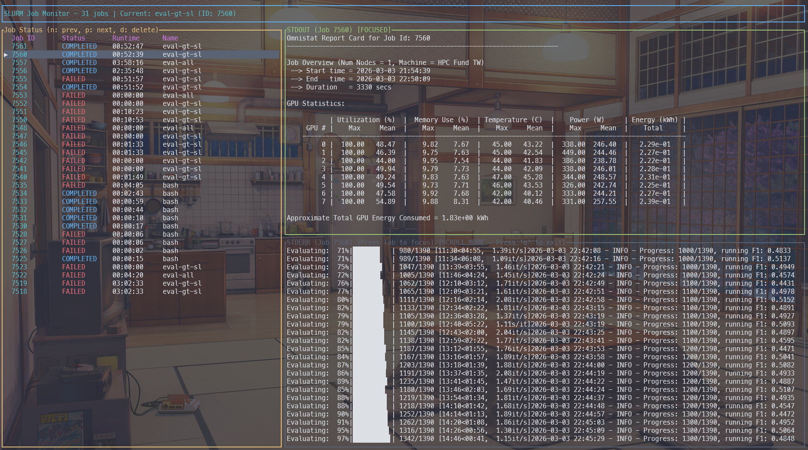

# SLURM Job Monitor

A real-time TUI for monitoring SLURM jobs -- see status, stdout, and stderr in one place.



## Features

- Real-time status monitoring (QUEUED -> RUNNING -> COMPLETED/FAILED)
- Live stdout/stderr tailing with word-wrap
- Multi-job support with easy switching
- Multiple layout modes (Horizontal, Vertical, Stacked, FullLog)
- Auto-discover jobs from `sacct`
- Single binary, no runtime dependencies

## Quick Start

### Install

```bash
cargo install --path .
# or
cargo build --release && cp target/release/slurm-monitor ~/.local/bin/
```

### Usage

```bash
# Monitor all your jobs (auto-discovers from sacct)
slurm-monitor watch

# Monitor specific jobs
slurm-monitor watch 12345 12346

# Submit and monitor
slurm-monitor submit my_job.sh
```

## UI Controls

| Key | Action |
|-----|--------|
| Tab | Switch stdout/stderr focus |
| Up/Down | Scroll focused panel |
| PgUp/PgDn | Scroll by page |
| Home/End | Jump to top/bottom |
| n | Previous job (vim-style) |
| p | Next job (vim-style) |
| d | Remove job from view |
| l | Cycle layout mode |
| Enter | Open focused log file in editor |
| q | Exit scroll mode / quit |
| Ctrl+C | Quit |
| Mouse click | Switch stdout/stderr panel focus |
| Mouse scroll | Scroll focused panel |

## Commands

| Command | Description |
|---------|-------------|
| `submit <script>` | Submit a batch script and start monitoring |
| `watch [job_ids...]` | Monitor jobs (all visible jobs if none specified) |
| `list` | List all tracked jobs with status |
| `stop <job_id>` | Informational only — prints a message, does not actually unsubscribe from monitoring |

Both `watch` and `submit` accept `--editor <cmd>` to override the editor for opening log files (Enter key). Resolution: CLI flag → `$VISUAL` → `$EDITOR` → `vim`.

Run `slurm-monitor <command> --help` for detailed options.

## Troubleshooting

**Job output files not found** -- Ensure the job has started (files are created at launch), you have read permissions, and output files are in the expected location. The tool checks `sacct` paths, then falls back to `slurm-<job_id>.out` in the current directory.

**Status shows UNKNOWN** -- The job ID may not exist, SLURM commands may not be in PATH, or there may be permission issues.

**UI not displaying correctly** -- Ensure your terminal supports colors and Unicode. If using tmux/screen, check terminal settings.

## License

MIT
